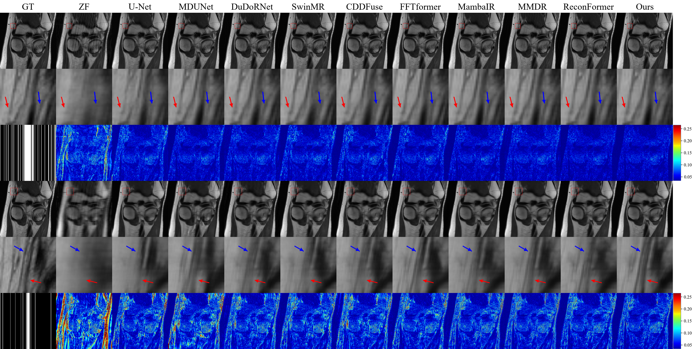
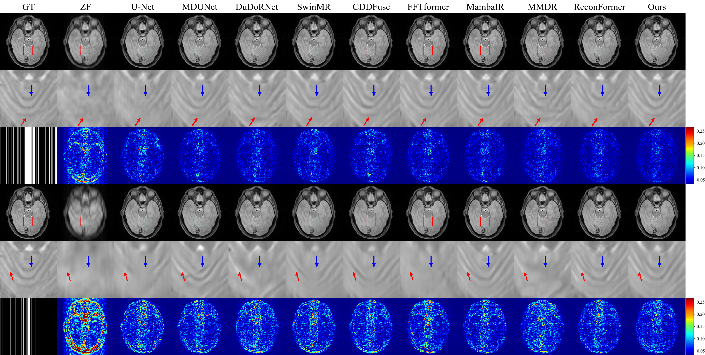
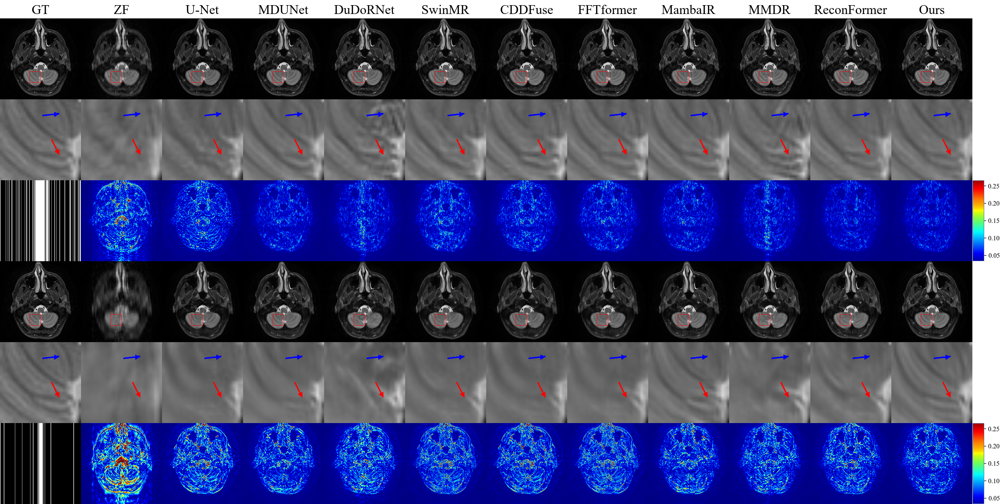

# DCMixRec
Detail-Contour Feature-Disentangled Mixed Heterogeneous Model for Multi-Contrast MRI Reconstruction.

## 📖 Introduction
DCMixRec is a novel deep learning framework designed for accelerated multi-contrast MRI reconstruction, addressing the critical challenge of long acquisition times in clinical MRI protocols. This project introduces a groundbreaking approach that synergistically integrates state-space models, self-attention mechanisms, and convolutional neural networks to achieve computationally efficient and context-aware MRI reconstruction.

## ✨ Key Innovations
- Mixed Heterogeneous Architecture

  **First-of-its-kind** fusion of state-space, self-attention, and convolutional models in MRI Reconstruction

- Detail-Contour Feature Disentanglement Encoder

  **Divide-and-conquer strategy**: Resolves the inherent trade-off between texture preservation and structural fidelity

- Dense State-Space Reconstruct Decoder

  **Multi-scale feature aggregation**: Balances global long-range dependencies with fine-grained local information

## 🏆 Performance Highlights

  
   
  FastMRI Knee PD modality Reconstruction

  
   
  SIMON Brain PD modality Reconstruction

  
   
  SIMON Brain T₂ modality Reconstruction

- Superior reconstruction quality​ on SIMON and fastMRI datasets

- Achieves better performance than mono-contrast methods by leveraging complementary information more effectively

- Exceptional performance​ in challenging low-sampling scenarios

- Proven generalizability​ across different anatomical regions and sampling protocols

## 💡 Clinical Impact

- Reducing MRI acquisition times while maintaining diagnostic quality

## 🚀 Get Started

Code will be released soon.

- Supporting multi-contrast protocols for comprehensive diagnostic imaging
